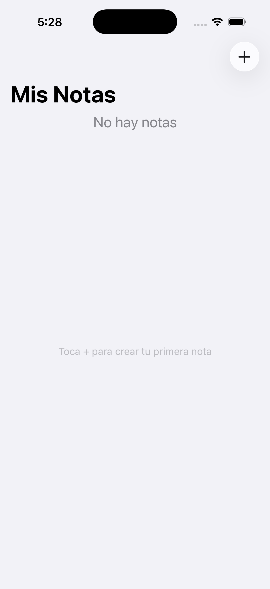
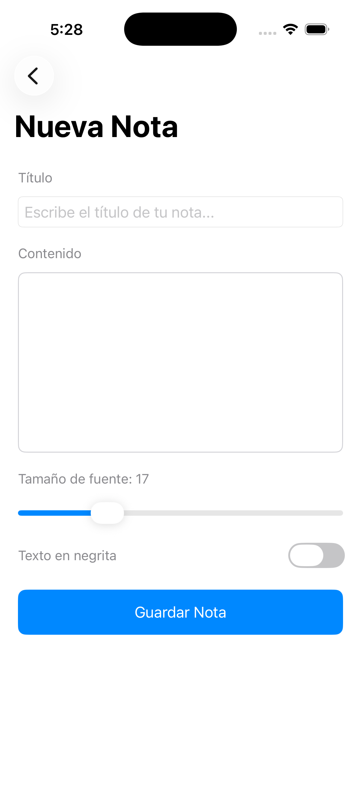
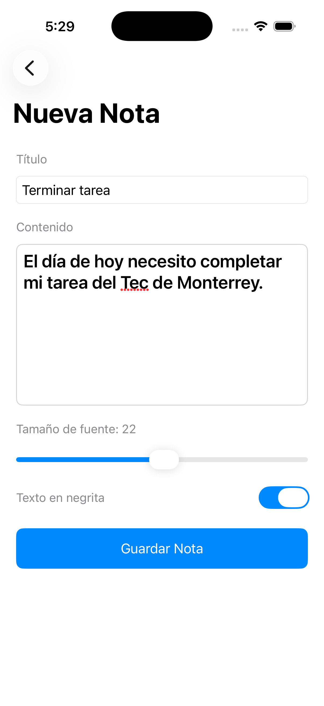
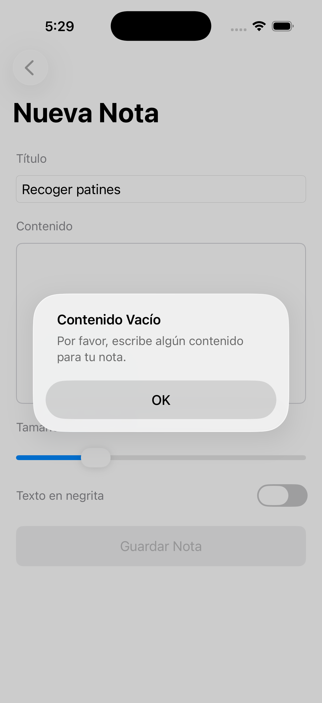
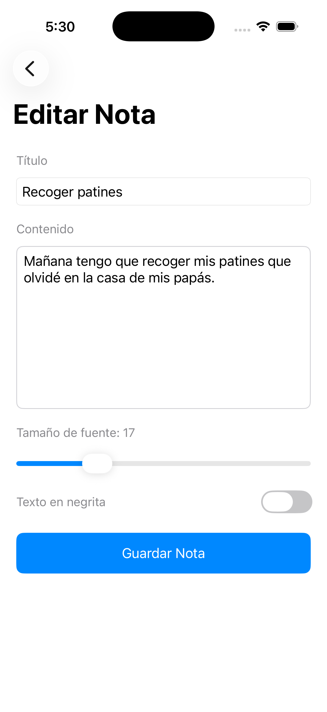
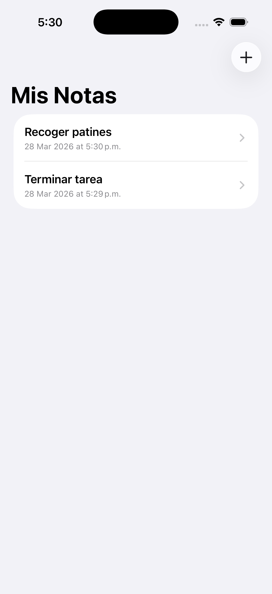

# MyNotes

Aplicacion iOS nativa de notas desarrollada con **UIKit** y **Swift**, construida completamente de forma programatica (sin Storyboards). Proyecto academico del Tecnologico de Monterrey enfocado en el dominio de interfaces graficas adaptables para iOS.

## Demo en Video

[](https://youtu.be/TPNoHEKkuPc?si=OSZDF7Obh7_f_pYX)

## Screenshots

<p align="center">
  
  
  
</p>
<p align="center">
  
  
  
</p>

## Funcionalidades

- **Crear notas** con titulo y contenido
- **Editar notas** existentes
- **Eliminar notas** con confirmacion mediante alerta
- **Validacion de entrada** — alertas al intentar guardar campos vacios
- **Personalizar texto** — slider para tamano de fuente (12–32pt) y toggle para negritas
- **Estado vacio** — mensaje orientativo cuando no hay notas
- **Interfaz adaptable** — compatible con iPhone y iPad mediante Auto Layout

## Arquitectura y Estructura

```
MyNotes/
├── AppDelegate.swift                # Ciclo de vida de la app
├── SceneDelegate.swift              # Configuracion de la ventana y navegacion raiz
├── Note.swift                       # Modelo de datos (struct con UUID, titulo, contenido, fecha)
├── NoteStore.swift                  # Almacen en memoria (CRUD de notas)
├── NotesListViewController.swift    # Pantalla principal — UITableView con estado vacio
├── NoteDetailViewController.swift   # Editor de nota — formulario con scroll y teclado
├── NoteCell.swift                   # Celda personalizada con UIStackView
└── Assets.xcassets/                 # Iconos de app (light, dark, tinted)
```

## Stack Tecnico

| Concepto | Implementacion |
|---|---|
| **Framework** | UIKit (100% programatico, sin Storyboards) |
| **Navegacion** | UINavigationController con push/pop |
| **Layout** | Auto Layout con NSLayoutConstraint, Safe Area y Keyboard Layout Guide |
| **Componentes UI** | UITableView, UITextField, UITextView, UISlider, UISwitch, UIButton, UIStackView, UILabel, UIAlertController |
| **Patron de datos** | Store inyectado desde SceneDelegate (almacenamiento en memoria) |
| **Lenguaje** | Swift |
| **IDE** | Xcode |

## Conceptos Clave Aplicados

- **Auto Layout programatico** — constraints activados con `NSLayoutConstraint.activate()` y `translatesAutoresizingMaskIntoConstraints = false`
- **Safe Area Layout Guide** — respeto de margenes seguros en todos los view controllers
- **Keyboard Layout Guide** — el scroll se ajusta automaticamente al aparecer el teclado
- **UIStackView** — composicion de formularios y celdas con spacing personalizado via `setCustomSpacing(after:)`
- **UIAlertController** — confirmacion destructiva para eliminacion y validacion de campos vacios
- **Swipe-to-delete** — gesto nativo de UITableView con accion destructiva
- **Large Titles** — navegacion con titulos grandes estilo iOS nativo

## Requisitos

- Xcode 15+
- iOS 17+
- No requiere dependencias externas

## Como Ejecutar

1. Clona el repositorio:
   ```bash
   git clone https://github.com/arzaluz-chris/MyNotes.git
   ```
2. Abre `MyNotes.xcodeproj` en Xcode
3. Selecciona un simulador (iPhone o iPad) y presiona **Cmd + R**
